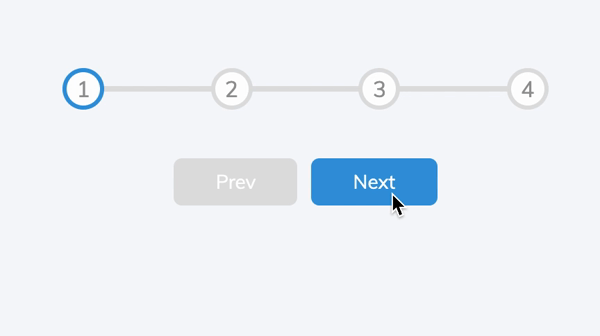

<div align="center" >
  
</div>

## Progress Bar example

This small projects is a quick reference to show a progress bar. CSS courtesy of [Brad Traversy](https://github.com/bradtraversy).

## Getting Started

First of all, make sure you&#39;ve installed [Node](https://nodejs.org).

Then install dependencies:

```bash
$ yarn
```

## Workflow

Start a local development server:

```bash
$ yarn start
```

Access invoicing under `http://localhost:3000/`

Format code:

```bash
$ yarn format
```

Lint code:

```bash
$ yarn lint
```

Commit changes:

```bash
$ yarn commmit
```

## Notes

1.- When using css-modules we need to find the classes in DOM as follow:

```bash
document.querySelectorAll<HTMLElement>(`.${classes.circle}`);
```

Without css-modules:

```bash
document.querySelectorAll<HTMLElement>(`.circle`);
```

2.- The initial load of DOM elements must be put inside a useEffect to ensure they are available before render.
useEffect with an empty dependencies array as a second argument, will ensure that the callback function will be called after the component renders for the first time.
